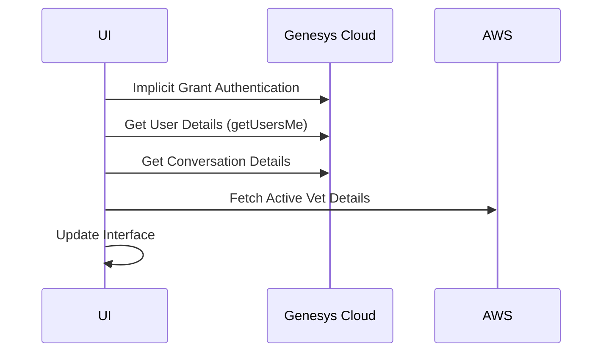

# TAS Vet ROTA Dialer

A Genesys Cloud integration widget that enables automated dialing to on-call veterinarians based on the current rota schedule.

## Overview

This application is a Genesys Cloud widget that integrates with an AWS backend to fetch active veterinarian details and facilitate direct dialing. It's designed to work within the Genesys Cloud interface, allowing agents to quickly connect customers with the currently on-call veterinarian.

## Required Configuration

### Genesys Cloud Phone Settings
- "Phone Settings" > "Placing calls with another app?" must be enabled
- This setting is crucial for the application to function properly and initiate outbound calls

## Technical Architecture

### Components

1. **Frontend Application**
   - HTML5 web application
   - Runs as a Genesys Cloud widget
   - Integrates with Genesys Cloud JavaScript SDK
   - Communicates with AWS backend via API endpoints

2. **Backend Integration**
   - AWS API Gateway endpoints
   - Environment-based configuration
   - Secure API key authentication

## API Flows

### 1. Application Initialization



### 2. Genesys Cloud API Endpoints Used

#### Authentication
- **Endpoint**: Implicit Grant OAuth 2.0
- **Purpose**: Initial authentication
- **Parameters**:
  - `clientId`: OAuth client ID
  - `redirectUri`: Application redirect URI

#### User Details
- **Endpoint**: `GET /api/v2/users/me`
- **Purpose**: Fetch current user information
- **Used In**: `startGCSDKs.js`

#### Conversation Details
- **Endpoint**: `GET /api/v2/conversations/callbacks/{conversationId}`
- **Purpose**: Fetch conversation participant details
- **Parameters**:
  - `conversationId`: Active conversation identifier
- **Response Data Used**:
  - Customer participant details
  - Queue ID
  - External contact ID

#### Call Initiation
- **Endpoint**: `POST /api/v2/conversations/calls`
- **Purpose**: Initiate outbound call
- **Parameters**:
  ```json
  {
    "phoneNumber": "string",
    "callFromQueueId": "string",
    "externalContactId": "string",
    "label": "string"
  }
  ```

### 3. Custom API Endpoints

#### Get Active Vet
- **Endpoint**: `GET /api/getActiveVet`
- **Purpose**: Fetch current on-call veterinarian details
- **Parameters**:
  - `datetime`: ISO timestamp
- **Headers**:
  - `X-Api-Key`: AWS API authentication
  - `Content-Type`: application/json

#### Get Configuration
- **Endpoint**: `GET /api/getConfig`
- **Purpose**: Fetch application configuration
- **Response**:
  ```json
  {
    "clientId": "string"
  }
  ```

## Application Flow

1. **Initialization**
   - Load application configuration
   - Initialize Genesys Cloud SDKs
   - Authenticate user
   - Extract conversation ID from URL

2. **Data Gathering**
   - Fetch conversation details from Genesys Cloud
   - Get current veterinarian details from AWS
   - Update UI with gathered information

3. **Call Initiation**
   - User clicks "Dial" button
   - Application validates destination number
   - Initiates call via Genesys Cloud API
   - Displays success/failure message

## Environment Variables

- `GC_OAUTH_CLIENT_ID`: Genesys Cloud OAuth client ID
- `AWS_API_ENDPOINT`: AWS API Gateway endpoint
- `AWS_API_KEY`: AWS API authentication key

## Security Considerations

1. **API Authentication**
   - Genesys Cloud OAuth 2.0 Implicit Grant
   - AWS API Key authentication
   - Environment variable protection

2. **Data Protection**
   - No sensitive data storage in localStorage
   - Minimal data persistence
   - Secure communication protocols

## Error Handling

The application implements comprehensive error handling:
- API call failures
- Missing conversation IDs
- Invalid veterinarian data
- Network connectivity issues

## Logging

Extensive logging is implemented throughout the application:
- API call tracking
- Error logging
- User action logging
- State changes
- All logs are prefixed with "TAS Vet ROTA Dialer" for easy filtering
